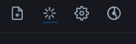
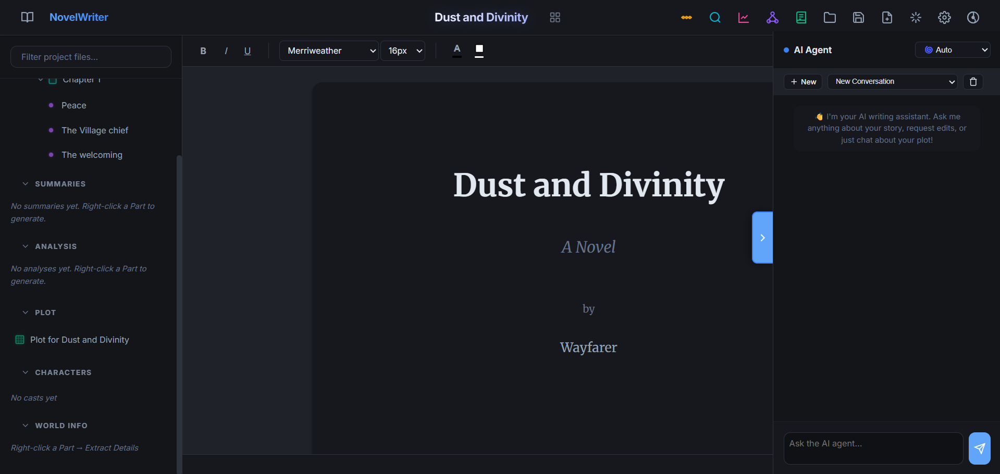
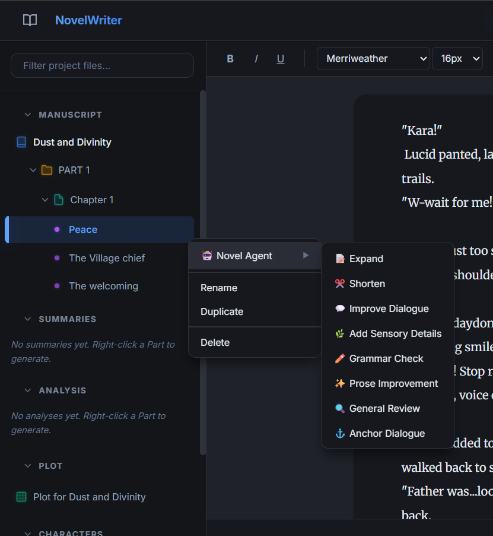
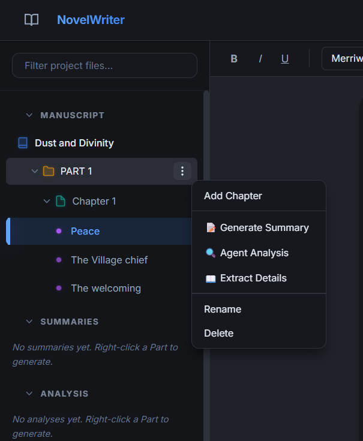
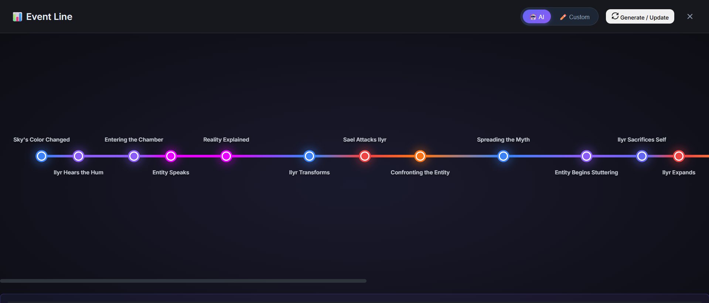
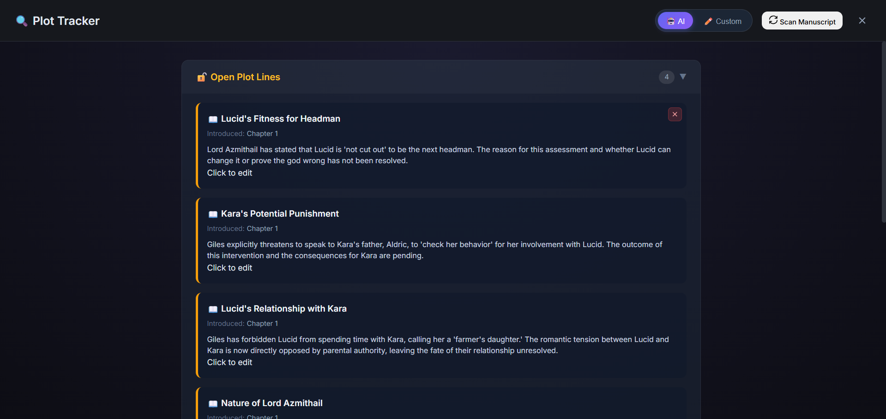
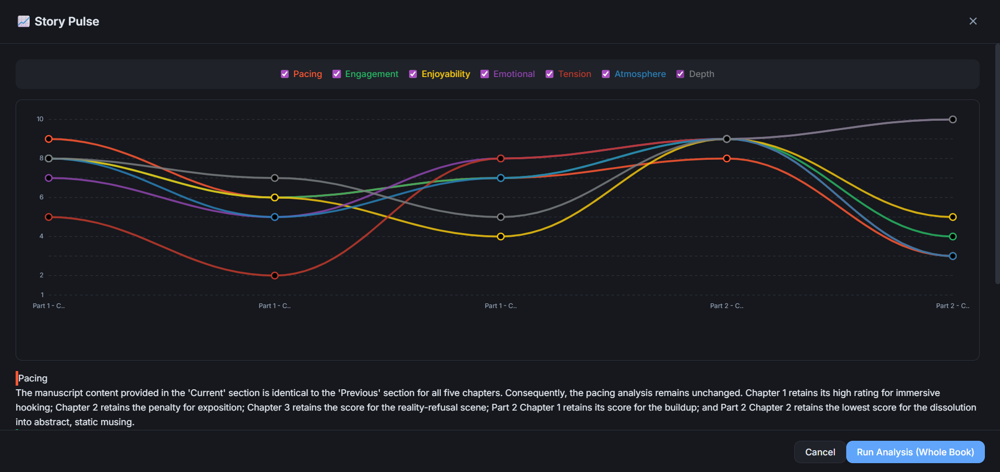
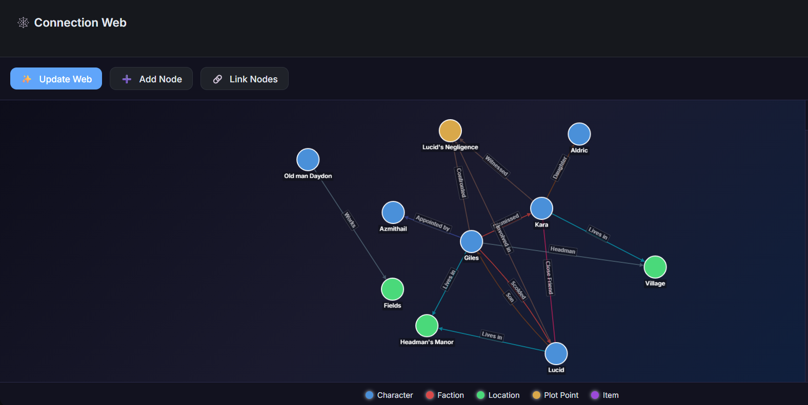
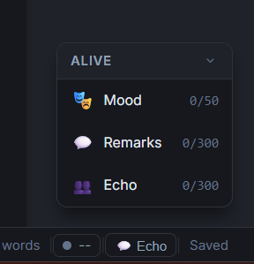

Welcome to NovelWriter.

This guide explains how to set up the AI features and how to use the core tools inside the app.

PS: You don't need to set up AI configuration to use the app...or use any AI features at all. But if you want to,
follow the guide below.

---

## Initial Setup (AI Configuration)

1. Open the app in your browser
2. Click on the API configuration button on the top right(Lined in blue)

3. In the configuration settings, set a **base url, api key and model id**. ( /chat/completions is already added to the base url) 
Should work with any openai compatible api.
- You can set a secondary model to use for the **Alive editor** feature.
- You can also set up an image model to generate mood art for chapters.

**Your API key is stored only in your browser’s localStorage.**

You can use free, local, or paid models depending on your preference.

---

## Understanding the Layout

NovelWriter is divided into three main areas:

- **Left Panel** — Project structure (Parts, Chapters, Scenes, Summaries, Agent analysis, Plot Grid, Characters and World info)
- **Center Editor** — Where you write
- **Right Panel** — Novel Agent (AI panel)

- Projects are saved automatically to browser's localStorage. You can create backup by clicking on save button in the top toolbar.

---

## The Novel Agent Panel (Right Side)

This is your AI assistant. It understands the scene you are currently viewing and has the context of the entire manuscript.

### Modes

You can switch between four modes:

- **Quick** — Fast answers and small tasks
- **Planning** — Story structure, plot discussions
- **Chatty** — Casual opinions and feedback
- **Brainstorm** — Creative idea generation

You can also leave it on **Auto**.

---

## Suggestion System (Right Click in Editor)

Click on the 3 dots next to any scene and expand the novel agent option to see a list of specific suggestion feaatures for that scene. Click on any of them to generate suggestions to refine your scene. 

Suggestions appear as blocks. You can:
- Ignore them
- Remove them
- Expand them into the agent panel for discussion 
(Right click on the suggestion block)

The AI never edits your manuscript directly.

---

## Smart Context System

When you ask the agent something like:

> “Does this look fine?”

The AI receives:

- Full context of the current part
- Summaries of other parts
- Character information

You can also force extra context using:

- `{world}` to include world info
- `{plot}` to include plot grids

---

## World Info & Summaries

For each part, you can generate:

- A summary of the section
- Extracted world information (names, items, events)

By clicking on the 3 dots next to any part.

These help the AI understand your story without using too many tokens.
**Generating summaries for your parts is essential for the agent to analyse your manuscript. So make sure to do so when you have multiple parts.**

---

**Smart Analysis tools**
Coloured options in toolbar.

1. **Event Line**

Generates a visual timeline of important events in your story.

- Color-coded by type (setup, conflict, emotional, action)
- Nodes spaced based on narrative distance
- Hover to see descriptions
- Can be edited
- Can also create manual event lines
- Regenerating will build upon the existing event line

---

2. **Plot Tracker**

Detects:

- Open plot lines
- Concluded plot lines
- Potential plot holes with severity ratings 
- Rescanning will build upon the existing plot tracker

---

3. **Story Pulse**

- Graphs your story across chapters for various metrics.
- Gives reasoning for the scores.

Helps you visually identify where chapters feel slow or intense.

---

4. **Connection Web**

Creates a relationship map between:

- Characters
- Locations
- Plot points
- Important concepts
- Can edit nodes
- Can also create manual connection webs
- Regenerating will build upon the existing connection web

Hovering a node highlights its connections.

---

## Alive Editor

A small collapsible panel in the bottom right that reacts as you type.

- Works through **letter triggers** i.e will react every time the letter count for the trigger is hit.
- Uses your alive editor configuration in api configuration

### Mood
Shows the current emotional tone of the scene you're writing.

### Remarks
Short reactions from preset personalities for the scene you're writing.

### Echo Chamber
A simulated group chat of readers reacting to changes in your manuscript over time.
- The echo chamber can be viewed by clicking on the **echo** button below the alive panel.
- This runs in the background and can be viewed anytime.

---

**Mood and Remakrs can be toggled and set their letter triggers in the settings.**
**Echo chamber can be toggled in the echo chamber panel itslef, along with letter trigger.**

## Plot Grid

A planning board that updates automatically as you add chapters and scenes.

Use it to outline plot lines before or during writing.

---

## Characters Section

Organize characters into casts and store important details.

This information is used as context for the AI.

---

## Mood Art (Chapter Cover)

Generates an image for the chapter based on its content and selected style.
- Uses your mood art configuration in api configuration
- Click on 3 dots next to any chapter to generate mood art.
- Images are stored locally on device, will have to select a folder to store them during first use.

Useful for setting tone while writing.

---

## Themes, Reading Mode, Export

- Multiple visual themes (Option next to settings in top right)

- Reading mode (Book button in top left)
- Focus mode (green square in top right below themes)
- Export your manuscript as PDF (Click on dashboard button next to book title top middle)

